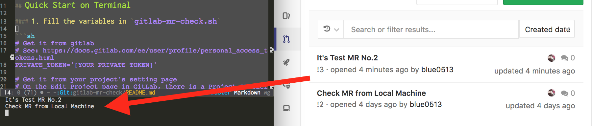

# GitLab-MR-Checker

Get MR Titles which You are assigned to!



## Features

+ You can check MR lists you are assigned to.
+ It filters MR which was closed.
+ It filters MR which has prefix "WIP".

## Quick Start on Terminal

#### 1. Fill the variables in `gitlab-mr-check.sh`

```sh
# Get it from gitlab
# See: https://docs.gitlab.com/ee/user/profile/personal_access_tokens.html
PRIVATE_TOKEN='[YOUR PRIVATE TOKEN]'

# Get it from your project's setting page
# On the Edit Project page in GitLab, there is a Project ID field in the top right corner.
PROJECT_ID='[YOUR PROJECT ID]'

# It should be like `https://gitlab.com`
PROJECT_BASE_URL='[YOUR PROJECT BASE URL]'

# Directory should be `my-project/product1`
PROJECT_DIRECTORY='[YOUR PROJECT DIRECTORY]'
```

#### 2. Execute!!

```sh
# It will show MR Titles in the result window
$ gitlab-mr-check.sh
```

## Start on Emacs

In the first step, you should fill the variables in `gitlab-mr-check.sh`.

#### 1. Edit `shell-path` in `gitlab-mr-check.el`

This package needs to call external shellscript.

```el
;; You need to edit this path
(defvar shell-path "path/to/gitlab-mr-check.sh")
```

#### 2. Install `shackle.el` from MELPA

This package use `shackle` to show the result window.

```el
M-x install-packege RET shackle
```

#### 3. Edit `init.el`

```el
;; add path
(add-to-list 'load-path "~/.emacs.d/gitlab-mr-check")
(require 'gitlab-mr-check)
```

#### 4. Execute!!

```el
M-x gitlab-mr-check RET
```
